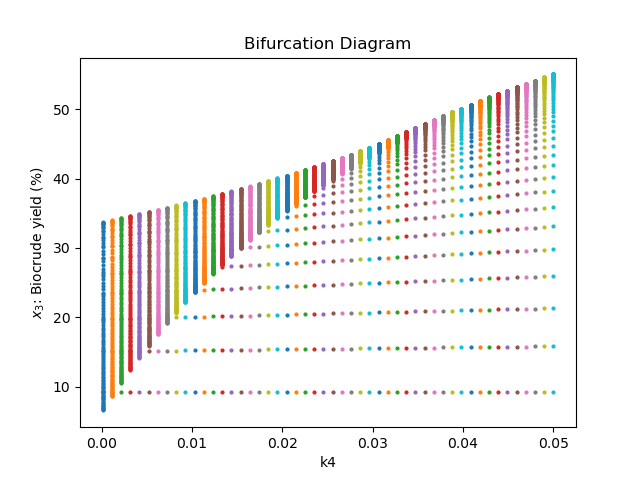
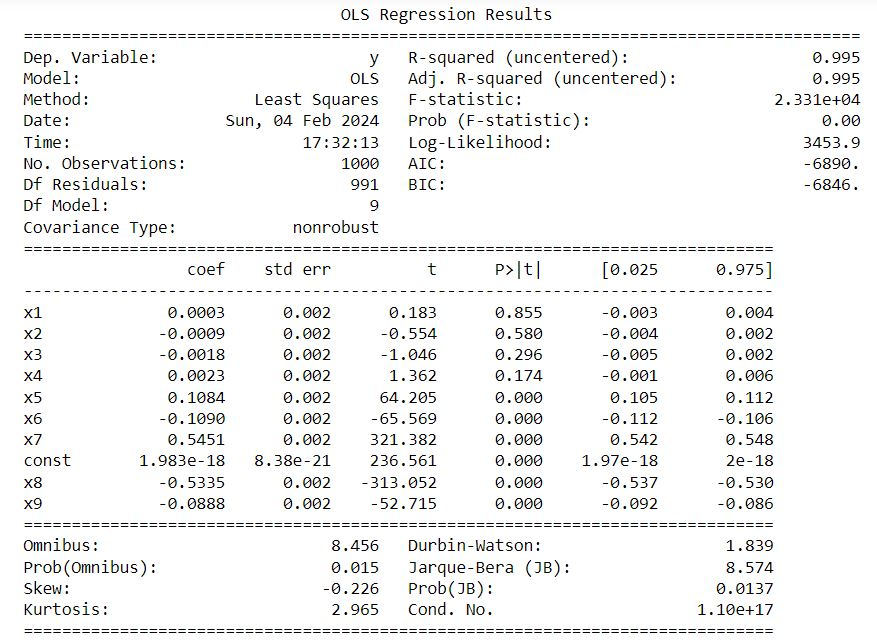

# Project 2 ChE 2410 - Hydrothermal Liquefaction of Microalgae
_Instructor: Dr. Jason Shoemaker_

_Student: Valentina Beltrán_

Chemical Engineering PhD program at Swanson School of Engineering- University of Pittsburgh

## Overview
This project aims to replicate and expand upon the study titled "A general kinetic model for the hydrothermal liquefaction of microalgae" by Peter J. Valdez, Vincent J. Tocco, and Phillip E. Savage, published in the Bioresource Journal in 2014. The primary focus is on developing a mathematical model based on two or more differential equations to describe the hydrothermal liquefaction process of microalgae, as proposed in the referenced paper.

## Motivation of the study

During my undergraduate thesis, I discovered a lack of information regarding the kinetics of hydrothermal liquefaction. Although many researchers have developed parameters, they vary significantly depending on the type of microalgae. Due to the variability in biomass composition, predicting these parameters becomes challenging. Therefore, it is beneficial to develop a mathematical model to determine the kinetic parameters of the hydrothermal liquefaction reaction using experimental data specific to the species of microalgae used in my previous work. This model can aid in improving future steps, such as constructing a pilot setup for this reaction.

# 1. Information used from the paper:

## 1.1 Mathematical Model

The reaction network is represented by the following paths: 

  
  
 Figure 1. HTL reaction network 

The mathematical model for the hydrothermal liquefaction system is represented by the following set of differential equations:

Proteins:
$\dot{x} _ {1_p} = -(k_{1_p} + k_{2_p}) \cdot x_{1_p} $ 

Lipids:
$\dot{x} _ {1_1} = -(k_{1_1} + k_{2_1}) \cdot x_{1_1} $

Carbohydrates:
$\dot{x} _ {1_c} = -(k_{1_c} + k_{2_c}) \cdot x_{1_c} $

Aqueous-phase products:
$\dot{x} _ 2 = -(k_4 + k_5) \cdot x_2 + k_{1_p} \cdot x_{1_p} + k_{1_1} \cdot x_{1_1} + k_{1_c} \cdot x_{1_c} + k_3 \cdot x_3 $

Biocrude:
$\dot{x} _ 3 = -(k_3 + k_6) \cdot x_3 + k_{2_p} \cdot x_{1_p} + k_{2_1} \cdot x_{1_1} + k_{2_c} \cdot x_{1_c} + k_4 \cdot x_2 $

Gas:
$\dot{x}_4 = k_5 \cdot x_2 + k_6 \cdot x_3 $

Total solids:
$x_1 = x_{1_p} + x_{1_1} + x_{1_c}$

## 1.2 Assumptions

The information provided in the paper pertains to the percentages of solids, aqueous phase, gas phase, and biocrude. However, Figure 1 illustrates that the reaction does not solely depend on solids as an individual component but rather on their percentage in macromolecules. Therefore, the concentration of each of these macromolecules was determined based on the composition of the microalgae under study. 

  
<b>Composition of Microalgae</b>

  | Component     | Percentage (%)|
  |---------------|------------|
  | Protein       | 56       |
  | Carbohydrates | 32       |
  | Lipids        | 9       |
  | Ash           | 3       |

## 2. Results

  
#### 2.1 Optimized Parameters (rate constants)

Table 2. Fitted parameters vs. reported in the paper

| Parameter | Value from the paper $min^{-1}$ | Value obtained this study $min^{-1}$ |
|-----------|----------------------|-----------------------|
| k1_p      | 0.2                  | 0.1172                |
| k2_p      | 0.13                 | 0.1880                |
| k1_1      | 0.35                 | 0.3101                |
| k2_1      | 0.4                  | 0.1353                |
| k1_c      | 0.35                 | 0.1588                |
| k2_c      | 0.0001               | 0.1627                |
| k4        | 0.12                 | 0.0245                |
| k5        | 0.0004               | 0.0000                |
| k3        | 0.14                 | 0.0321                |
| k6        | 0.0002               | 0.0017                |

Figure 3. Shows the comparison between the experimental data, the fitted parameters in this study and the fitting presented on the paper. It can be observed that the prediction of the parameters reported in the paper is not the most correct for the aqueous phase and the biocrude compared to the data.

  
  
 Figure 3. Experimental Data vs. fit 

### 2.2 Bifurcation analysis

A bifurcation analysis was performed by solving the system of differential equations and changing the value of $k_{4}$ from 0.0001 to 0.05 $min^{-1}$  

  
  
 Bifurcation diagram 

### 2.3 Sensitivity analysis

Now, to determine the effect of the parameters on the variables under study, I ran a sensitivity analysis observing the response on the variable $x_{3}$, which is the variable of interest since it represents the biocrude yield.

#### 2.3.1 Local sensitivity analysis 

How the biocrude yield reacts to a 1% change in the parameters?

Parameters $k_{3}$ and $k_{4}$ are the ones that most affect the variable: 

  
  
 Figure 4. Experimental Data vs. fit 

Based on prior experience, I've found that separating the aqueous phase and the biocrude is often difficult due to their intermingling after the reaction. This challenge is highlighted by the reaction network scheme in Figure 1, where k3 and k4 represent the reaction constants governing these phases. Consequently, it's understandable that these constants exert a significant influence on the final product even with small changes.

#### 2.3.2 Global sensitivity analysis

How the biocrude yield reacts now to bigger changes  (25%) ?

  
  

Based on the linear regression results it can be observed that $k_{1,p}$ , $k_{2,p}$, $k_{1,1}$, and $k_{2,1}$ are not significant parameters, therefore, our final equation for the normalized sensitivity will be:

$y$ = 0.1084* $k_{1,c}$  -0.1090* $k_{2,c}$  +0.5451* $k_{4}$  -0.5335* $k_{3}$ -0.0888* $k_{6}$

The set of parameters encountered is valid in the range of +/- 25% of variation.

### 3. Conclusions

* Through optimization techniques, the study obtained rate constants for various reactions involved in the hydrothermal liquefaction process. A comparison between the fitted parameters from this study and those reported in the literature revealed discrepancies, particularly in the aqueous phase and biocrude predictions. This highlights the importance of experimentally derived parameters tailored to specific microalgae species.
* A sensitivity analysis was conducted to investigate the effects of parameter variations on the biocrude yield, a crucial output of the hydrothermal liquefaction process. Both local and global sensitivity analyses were performed, revealing that reaction constants (e.g., $k_{3}$ and $k_{4}$) significantly influence biocrude yield. Moreover, a global sensitivity analysis identified the most influential parameters and their respective impact on the biocrude yield within a specified range of variation.
* The developed mathematical model and the insights gained from the sensitivity analysis have practical implications for the optimization of hydrothermal liquefaction processes. By understanding the key parameters influencing biocrude yield, researchers and engineers can fine-tune process conditions to enhance biocrude production efficiency.

### 4. Future work

The study identified challenges associated with separating the aqueous phase and biocrude, indicating the complexity of the reaction network and the need for precise parameter estimation. Future research could focus on refining the model to account for these challenges and improving the accuracy of parameter predictions.

### 5. References

Valdez, P. J., Tocco, V. J., & Savage, P. E. (Year). A general kinetic model for the hydrothermal liquefaction of microalgae. *Journal Name*, Volume(Issue), Page range.

Contact: vvb8@pitt.edu
