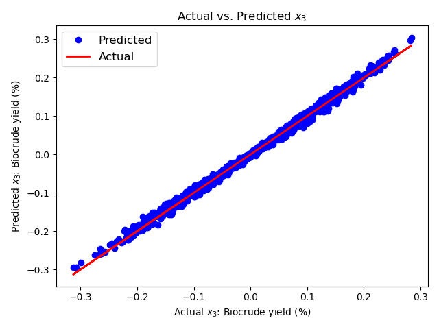

# Project 2 ChE 2410 - Hydrothermal Liquefaction of Microalgae
## Overview
This project aims to replicate and expand upon the study titled "A general kinetic model for the hydrothermal liquefaction of microalgae" by Peter J. Valdez, Vincent J. Tocco, and Phillip E. Savage, published in the Bioresource Journal in 2014. The primary focus is on developing a mathematical model based on two or more differential equations to describe the hydrothermal liquefaction process of microalgae, as proposed in the referenced paper.

## Motivation of the study

During my undergraduate thesis, I discovered a lack of information regarding the kinetics of hydrothermal liquefaction. Although many researchers have developed parameters, they vary significantly depending on the type of microalgae. Due to the variability in biomass composition, predicting these parameters becomes challenging. Therefore, it is beneficial to develop a mathematical model to determine the kinetic parameters of the hydrothermal liquefaction reaction using experimental data specific to the species of microalgae used in my previous work. This model can aid in improving future steps, such as constructing a pilot setup for this reaction.

# 1. Information used from the paper:

## 1.1 Mathematical Model

The reaction network is represented by the following paths: 

  
  
 Figure 1. HTL reaction network 

The mathematical model for the hydrothermal liquefaction system is represented by the following set of differential equations:

Proteins:
$\dot{x} _ {1_p} = -(k_{1_p} + k_{2_p}) \cdot x_{1_p} $ 

Lipids:
$\dot{x} _ {1_1} = -(k_{1_1} + k_{2_1}) \cdot x_{1_1} $

Carbohydrates:
$\dot{x} _ {1_c} = -(k_{1_c} + k_{2_c}) \cdot x_{1_c} $

Aqueous-phase products:
$\dot{x} _ 2 = -(k_4 + k_5) \cdot x_2 + k_{1_p} \cdot x_{1_p} + k_{1_1} \cdot x_{1_1} + k_{1_c} \cdot x_{1_c} + k_3 \cdot x_3 $

Biocrude:
$\dot{x} _ 3 = -(k_3 + k_6) \cdot x_3 + k_{2_p} \cdot x_{1_p} + k_{2_1} \cdot x_{1_1} + k_{2_c} \cdot x_{1_c} + k_4 \cdot x_2 $

Gas:
$\dot{x}_4 = k_5 \cdot x_2 + k_6 \cdot x_3 $

Total solids:
$x_1 = x_{1_p} + x_{1_1} + x_{1_c}$

## 1.2 Assumptions

The information provided in the paper pertains to the percentages of solids, aqueous phase, gas phase, and biocrude. However, Figure 1 illustrates that the reaction does not solely depend on solids as an individual component but rather on their percentage in macromolecules. Therefore, the concentration of each of these macromolecules was determined based on the composition of the microalgae under study. 

  
<b>Composition of Microalgae</b>

  | Component     | Percentage (%)|
  |---------------|------------|
  | Protein       | 56       |
  | Carbohydrates | 32       |
  | Lipids        | 9       |
  | Ash           | 3       |

## 2 Results

  
#### 2.1 Optimized Parameters (rate constants)

Table 2. Fitted parameters vs. reported in the paper

| Parameter | Value from the paper | Value obtained this study |
|-----------|----------------------|-----------------------|
| k1_p      | 0.2                  | 0.1172                |
| k2_p      | 0.13                 | 0.1880                |
| k1_1      | 0.35                 | 0.3101                |
| k2_1      | 0.4                  | 0.1353                |
| k1_c      | 0.35                 | 0.1588                |
| k2_c      | 0.0001               | 0.1627                |
| k4        | 0.12                 | 0.0245                |
| k5        | 0.0004               | 0.0000                |
| k3        | 0.14                 | 0.0321                |
| k6        | 0.0002               | 0.0017                |

Figure 3. Shows the comparison between the experimental data, the fitted parameters in this study and the fitting presented on the paper. It can be observed that the prediction of the parameters reported in the paper is not the most correct for the aqueous phase and the biocrude compared to the data.

  
  
 Figure 3. Experimental Data vs. fit 

### 2.2 Sensitivity analysis

Now, to determine the effect of the parameters on the variables under study, I ran a sensitivity analysis observing the response on the variable $x_{3}$, which is the variable of interest since it represents the biocrude yield.

#### 2.2.1 Local sensitivity analysis 

How the biocrude yield reacts to a 1% change in the parameters?

Parameters $k_{3}$ and $k_{4}$ are the ones that most affect the variable: 

  
  
 Figure 4. Experimental Data vs. fit 

Based on prior experience, I've found that separating the aqueous phase and the biocrude is often difficult due to their intermingling after the reaction. This challenge is highlighted by the reaction network scheme in Figure 1, where k3 and k4 represent the reaction constants governing these phases. Consequently, it's understandable that these constants exert a significant influence on the final product even with small changes.

#### 2.2.2 Global sensitivity analysis

How the biocrude yield reacts now to bigger changes  (25%) ?

  
  
 Figure 5. Experimental Data vs. fit 

